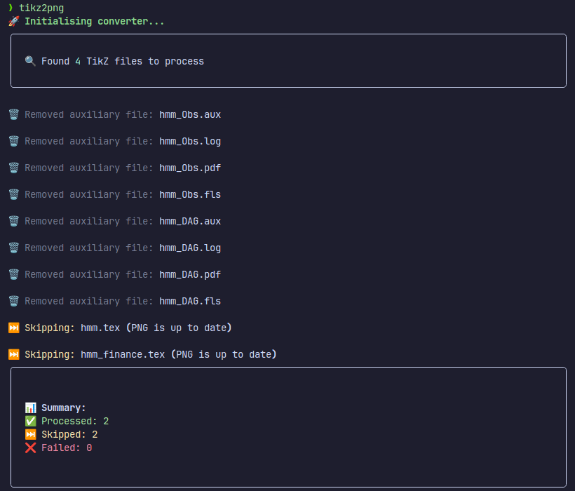

# tikz2png

A Python tool to convert TikZ diagrams to PNG images with minimal setup.

## Requirements

- Python 3.9 or higher
- pipx
- LaTeX installation with:
  - pdflatex
  - TikZ/PGF packages
- ImageMagick

## Installation

1. Clone the repository:

   ```bash
   git clone https://github.com/yourusername/tikz2png.git
   cd tikz2png
   ```

2. Make the setup script executable (Unix):

   ```bash
   chmod +x setup.sh
   ```

3. Run the installation script:

   ```bash
   # On Linux/macOS:
   ./setup.sh

   # On Windows:
   setup.bat
   ```

The setup script will:

- Check for Python 3.9+ installation
- Install pipx if not present (with your permission)
- Install/upgrade tikz2png and its dependencies
- Add tikz2png to your system PATH

If you already have tikz2png installed, the setup script will automatically upgrade it to the latest version.

## Usage

### Basic Usage

Place your TikZ files in `./Assets/TikZ/` and run:

```bash
tikz2png
```

The converted PNG files will be saved in `./Assets/figures/`.



### Command-line Options

- `-q, --quiet`: Reduce logging verbosity
- `-f, --force`: Force regeneration of all PNG files
- `--tikz-dir PATH`: Custom directory for TikZ files
- `--output-dir PATH`: Custom directory for PNG outputs

### Example

```bash
tikz2png --tikz-dir ./diagrams --output-dir ./images --force
```

## Directory Structure

Without passing in args for `tikz-dir` and `output-dir` we assume:

```
your-project/
├── Assets/
│   ├── TikZ/     # Place your .tex files here
│   └── figures/  # Generated PNG files appear here
```

## File Format

Your TikZ files should be standalone LaTeX documents. Example:

```latex
\documentclass{standalone}
\usepackage{tikz}
\begin{document}
\begin{tikzpicture}
    % Your TikZ code here
\end{tikzpicture}
\end{document}
```

## Troubleshooting

### LaTeX Errors

- Ensure pdflatex is in your system PATH

### ImageMagick Errors

- Verify ImageMagick is properly installed and in your system PATH

## Development Setup

1. Clone and setup development environment:

   ```bash
   git clone https://github.com/sj-bs/tikz2png.git
   cd tikz2png
   ```

2. Install development dependencies:

   ```bash
   # Install the package with development dependencies
   pipx install -e ".[dev]"

   # Or if you want to use pip directly
   pip install -e ".[dev]"
   ```

3. Run tests:

   ```bash
   pytest               # Run all tests
   pytest --cov         # Run with coverage
   ```

4. Check code style:

   ```bash
   ruff check .        # Run linter
   ruff format .       # Run formatter
   ```

Note: This project uses `pyproject.toml` for dependency management and `hatchling` as the build backend.
All dependencies and build configuration can be found in `pyproject.toml`.

## TODO

- Flags to pass additional commands into pdflatex and Magick
- Flag to specify the version of the package
- More flexible setup process
- Support for persisting configuration setups
- Flag to set which auxiliary files to keep/delete
- Flag to remove auxiliary files even if the tikz file is not regenerated
- Support for asymptote files (maybe)
- Support for other LaTeX engines (maybe)
